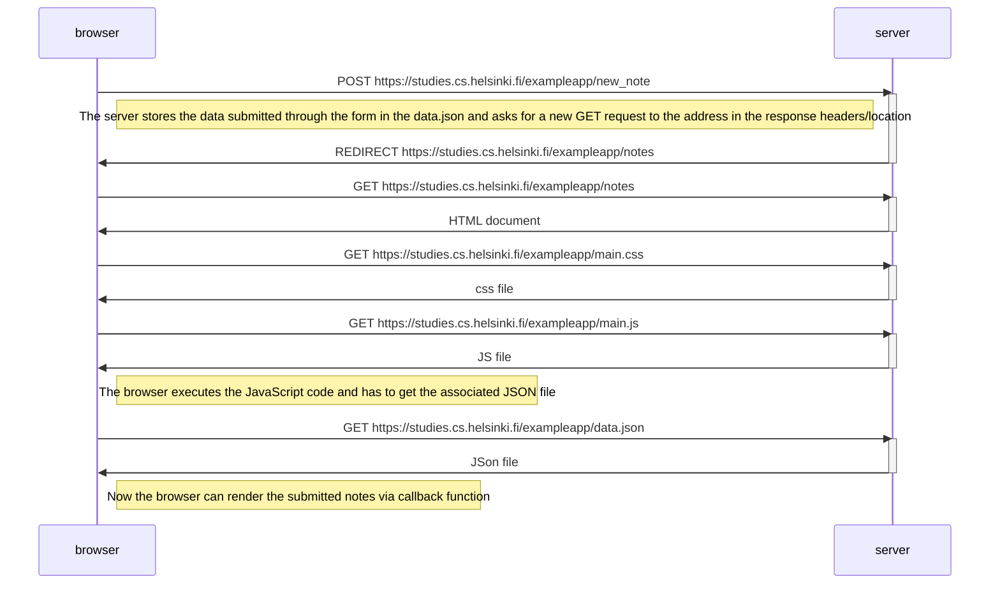

```mermaid
sequenceDiagram
    participant browser
    participant server

    browser->>server: POST https://studies.cs.helsinki.fi/exampleapp/new_note
    activate server

    Note left of server: The server stores the data submitted through the form in the data.json and asks for a new GET request to the address in the response headers/location

    server->>browser: REDIRECT https://studies.cs.helsinki.fi/exampleapp/notes
    deactivate server

    
    browser->>server: GET https://studies.cs.helsinki.fi/exampleapp/notes
    activate server
    server->>browser: HTML document
    deactivate server

    browser->>server: GET https://studies.cs.helsinki.fi/exampleapp/main.css
    activate server
    server->>browser: css file
    deactivate server

    browser->>server: GET https://studies.cs.helsinki.fi/exampleapp/main.js
    activate server
    server->>browser: JS file
    deactivate server

    Note right of browser: The browser executes the JavaScript code and has to get the associated JSON file

    browser->>server: GET https://studies.cs.helsinki.fi/exampleapp/data.json
    activate server
    server->>browser: JSon file
    deactivate server

    Note right of browser: Now the browser can render the submitted notes via callback function

```
