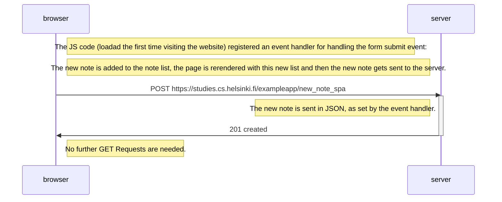

```mermaid
sequenceDiagram
    participant browser
    participant server

    Note right of browser: The JS code (loadad the first time visiting the website) registered an event handler for handling the form submit event:
    Note right of browser: The new note is added to the note list, the page is rerendered with this new list and then the new note gets sent to the server.

    browser->>server: POST https://studies.cs.helsinki.fi/exampleapp/new_note_spa
    activate server
    Note left of server: The new note is sent in JSON, as set by the event handler.
    server->>browser: 201 created
    deactivate server

    Note right of browser: No further GET Requests are needed.
```
